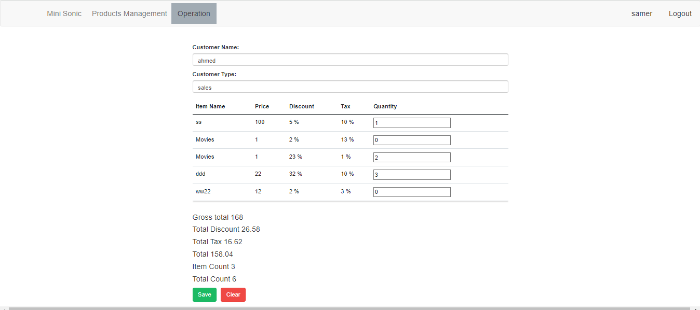

# Project Summary

## Title: SonicMini

## ERD

## Technologies Used:
- **Frontend Framework:** Angular [Version]
- **Backend Framework:** .NET [Version]
- **API:** .NET Web API [Version]
- **Database:** SQL Server [Version]

## Screen's:
### login

### Operations

### Product management 

